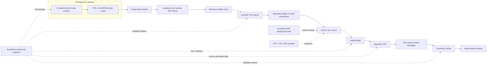

<div align="center">

# SynthRAN

**Deterministic IoT workloads over an open 5G user plane, with reproducible evidence from setup to analysis.**

[](pyproject.toml)
[](docs/architecture.md)
[](docs/experiment.md)
[](docs/results.md)
[](LICENSE)

</div>

## Why SynthRAN exists

Open 5G components and IoT simulators can each run independently. The harder research problem is making them form **one controlled experiment** whose workload, network state, measurements, cleanup, and outputs can all be reproduced and checked.

SynthRAN is that integration and evidence layer. It can:

- generate deterministic sensor traffic in **Contiki-NG/Cooja**;
- carry it through **srsUE → srsRAN → Open5GS**;
- apply calibrated background load through the same UE path;
- collect RTT, UE/UPF counters, telemetry, and load evidence inside fixed measurement windows;
- retain raw JSONL, deterministic Parquet, validity evidence, campaign schedules, and analysis.

It does not reimplement Open5GS, srsRAN, Contiki-NG, Cooja, Mosquitto, iperf3, or SLICES provider services.

## Golden Path



In exact execution order:

```text
10 deterministic Contiki-NG/Cooja sensors
-> RPL/6LoWPAN border router
-> Cooja Serial Socket
-> loopback-only reverse SSH tunnel
-> remote tunslip6/tun0
-> counted TCP ingress
-> Mosquitto bridge inside srsUE network namespace
-> tun_srsue1
-> srsRAN gNB
-> Open5GS UPF
-> run-owned central Mosquitto
-> canonical JSONL
-> deterministic Parquet
```

The accepted virtual configuration uses RFSIM, one srsUE as the IoT edge gateway, one SST-1 slice, and ten deterministic sensors. Research load terminates on a prepared external node rather than the 5G core host.

## Current status

<table align="center">
  <thead>
    <tr><th align="center">Evidence</th><th align="center">Accepted result</th></tr>
  </thead>
  <tbody>
    <tr><td align="center">Campaign</td><td align="center"><code>campaign-20260819-06</code></td></tr>
    <tr><td align="center">Experimental units</td><td align="center">12 / 12 valid runs</td></tr>
    <tr><td align="center">Design</td><td align="center">3 seeds × baseline / 50% / 80% / 95% load</td></tr>
    <tr><td align="center">Reference UE-path capacity</td><td align="center">66.37 Mbps</td></tr>
    <tr><td align="center">RTT probes</td><td align="center">2,160 attempts, 0 timeouts</td></tr>
    <tr><td align="center">Telemetry sequence integrity</td><td align="center">0 gaps, 0 duplicates</td></tr>
    <tr><td align="center">Loaded UDP transport</td><td align="center">0 receiver packet loss in all 9 loaded runs</td></tr>
    <tr><td align="center">Maximum sustained treatment</td><td align="center">95% reference capacity (~63.05 Mbps)</td></tr>
    <tr><td align="center">Preservation</td><td align="center">raw campaign archive + analysis in SLICES object storage</td></tr>
  </tbody>
</table>

The exploratory RTT result is unusual: all continuously loaded conditions measured lower RTT than the idle baseline. The raw traces show the separation across the full measurement window, but three independent blocks are not enough for a causal claim. See **[current results](docs/results.md)** for the exact evidence and limitations.

## Quick start

The live path is Linux-first and currently targets the SLICES/Post5G environment. The commands below show the full order of operations; use unique IDs for every real run.

### 1. Get SLICES access

You need:

- a SLICES account;
- membership in a SLICES project that can use the required resources;
- the SLICES/Post5G/POS command-line tools on the controller;
- this repository's locked Conda environment.

A **project is required**, but SynthRAN does not create projects. Request a new project or join an existing one in the SLICES portal. `post5g-beta` is an example project for the Post5G beta service.

```bash
slices auth login
slices project list
slices project use PROJECT_NAME
slices auth show
slices project show
```

### 2. Create the provider experiment and Post5G prefix

The current live SynthRAN path requires an **existing SLICES experiment** and an **active Post5G network prefix**. SynthRAN verifies these objects but does not create them silently.

```bash
export PROJECT_NAME=PROJECT_NAME
export PROVIDER_EXPERIMENT=EXPERIMENT_NAME

slices project use "$PROJECT_NAME"
slices experiment create "$PROVIDER_EXPERIMENT" --duration 4h
post5g experiment prefix "$PROVIDER_EXPERIMENT"

export SYNTHRAN_SLICES_PROJECT="$PROJECT_NAME"
export SYNTHRAN_SLICES_EXPERIMENT="$PROVIDER_EXPERIMENT"
```

Keep the prefix active until the experiment is finished. Release it only when the provider network identity is no longer needed.

### 3. Prepare SynthRAN

```bash
git clone https://github.com/RA-Nayreed/SynthRAN.git
cd SynthRAN

conda env create -f environment.yml
conda activate synthran
python -m synthran deps sync
python -m unittest discover -s tests -v

python -m synthran slices doctor
```

### 4. Reserve and prepare the two-node virtual testbed

`network prepare` is the explicit resource mutation. Without `--reservation-id`, it can create the required POS reservation, allocate the reviewed core/RAN nodes, image them, and prepare prerequisites.

```bash
export PREPARATION_RUN=prepare-001
export SYNTHRAN_OWNER=YOUR_SLICES_USERNAME

python -m synthran network prepare \
  --owner "$SYNTHRAN_OWNER" \
  --duration-minutes 120 \
  --run-id "$PREPARATION_RUN"

source ".synthran/preparations/$PREPARATION_RUN/authority.env"
export INVENTORY=".synthran/preparations/$PREPARATION_RUN/hosts.ini"
```

### 5. Preflight, deploy, and prove the 5G path

```bash
python -m synthran doctor \
  --inventory "$INVENTORY" \
  --evidence-out .synthran/preflight.json

export NETWORK_RUN=network-001

python -m synthran network deploy \
  --inventory "$INVENTORY" \
  --preflight-evidence .synthran/preflight.json \
  --run-id "$NETWORK_RUN"

python -m synthran network verify \
  --inventory "$INVENTORY" \
  --run-id "$NETWORK_RUN" \
  --timeout 120
```

Do not start the research campaign until verification reports a path-proven network.

### 6. Calibrate against an external peer

The research peer must be outside the core host. In the supported two-node virtual setup, use the provider-facing IPv4 address of the prepared RAN node.

```bash
ansible -i "$INVENTORY" ran_node -m shell -a 'ip -4 -o addr show; ip -4 route show default'

export MEASUREMENT_PEER_IP=PEER_IPV4
export CALIBRATION=.synthran/research/capacity.json

python -m synthran experiment research calibrate \
  --inventory "$INVENTORY" \
  --network-run-id "$NETWORK_RUN" \
  --target "$MEASUREMENT_PEER_IP" \
  --duration-seconds 10 \
  --out "$CALIBRATION"

export REFERENCE_BPS=$(jq -r '.reference_capacity_bps' "$CALIBRATION")
```

### 7. Plan and run a controlled campaign

```bash
export CAMPAIGN_ID=campaign-001
export CAMPAIGN_FILE=".synthran/campaigns/$CAMPAIGN_ID.json"
export RUN_ROOT=".synthran/experiments"

python -m synthran experiment research campaign-plan \
  --campaign-id "$CAMPAIGN_ID" \
  --network-run-id "$NETWORK_RUN" \
  --seeds 424242,424243,424244 \
  --conditions baseline,load50:0.5,load80:0.8,load95:0.95 \
  --campaign-seed 12345 \
  --out "$CAMPAIGN_FILE"

python -m synthran experiment research campaign-run \
  --campaign "$CAMPAIGN_FILE" \
  --inventory "$INVENTORY" \
  --target "$MEASUREMENT_PEER_IP" \
  --reference-capacity-bps "$REFERENCE_BPS" \
  --sensor-period 5 \
  --warmup-seconds 30 \
  --duration-seconds 180 \
  --sample-interval 1 \
  --probe-interval 1 \
  --parallel-flows 2 \
  --load-port 5220 \
  --run-root "$RUN_ROOT"
```

### 8. Analyze the persisted valid runs

```bash
mkdir -p .synthran/reports

python -m synthran experiment research analyze \
  --campaign "$CAMPAIGN_FILE" \
  --run-root "$RUN_ROOT" \
  --out ".synthran/reports/$CAMPAIGN_ID-analysis.json"
```

The analyzer uses persisted validity gates and pairs each loaded treatment with the matching seed-block baseline.

### 9. Finish provider use cleanly

Preserve the raw evidence first. When the provider prefix is no longer needed:

```bash
post5g experiment prefix "$PROVIDER_EXPERIMENT" --release
```

The full operational contract, recovery rules, S3 preservation workflow, and failure handling are in **[docs/operator-guide.md](docs/operator-guide.md)**.

## Planned experiment output

A valid controlled run produces evidence such as:

```text
experiment-spec.json
measurement-window.json
measurement-path.json
telemetry.jsonl / telemetry.parquet
probe.jsonl / probe.parquet
network-samples.jsonl / network-samples.parquet
load.jsonl / load.parquet       # loaded conditions
research-summary.json
```

JSONL remains the append-only audit source; Parquet is the deterministic analysis derivative. The accepted campaign's unrounded analysis JSON is tracked under [`results/`](results/), while the complete immutable raw campaign bundle is preserved in SLICES object storage.

## Repository guide

<table align="center">
  <thead>
    <tr><th align="center">Area</th><th align="center">Start here</th></tr>
  </thead>
  <tbody>
    <tr><td align="center">Measured results and limitations</td><td align="center"><a href="docs/results.md">docs/results.md</a></td></tr>
    <tr><td align="center">Experiment protocol</td><td align="center"><a href="docs/experiment.md">docs/experiment.md</a></td></tr>
    <tr><td align="center">System architecture</td><td align="center"><a href="docs/architecture.md">docs/architecture.md</a></td></tr>
    <tr><td align="center">End-to-end live operation</td><td align="center"><a href="docs/operator-guide.md">docs/operator-guide.md</a></td></tr>
    <tr><td align="center">Development</td><td align="center"><a href="docs/development.md">docs/development.md</a></td></tr>
    <tr><td align="center">Dependencies</td><td align="center"><a href="docs/dependencies.md">docs/dependencies.md</a></td></tr>
    <tr><td align="center">Security and privacy</td><td align="center"><a href="docs/security.md">docs/security.md</a></td></tr>
    <tr><td align="center">External measurement peer</td><td align="center"><a href="docs/research-measurement-peer.md">docs/research-measurement-peer.md</a></td></tr>
    <tr><td align="center">Contributor invariants</td><td align="center"><a href="AGENTS.md">AGENTS.md</a></td></tr>
  </tbody>
</table>

## Current scope

**Live accepted:** Open5GS + srsRAN + one srsUE + RFSIM, deterministic Cooja/RPL telemetry, external-peer capacity calibration, controlled UDP load, fixed-window RTT/network measurement, blocked campaigns, and offline paired analysis.

**Not claimed yet:** physical RF acceptance, multiple UEs/slices, formal A1/E2/RIC control, generative models, or automated RAN-policy synthesis.

---

<div align="center">
<sub>Built for experiments where the evidence matters as much as the result.</sub>
</div>
