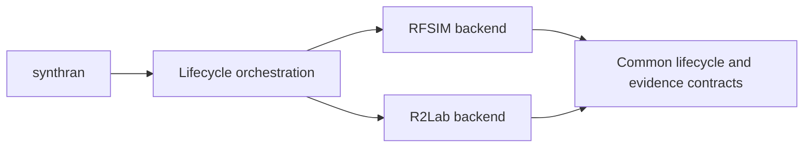

<div align="center">

# SynthRAN

**Deterministic IoT workloads over an open 5G user plane, with reproducible evidence from setup to analysis.**

[](pyproject.toml)
[](docs/architecture.md)
[](docs/experiment.md)
[](LICENSE)

</div>

## Why SynthRAN exists

Open 5G components and IoT simulators can each run independently. The harder research problem is making them form one controlled experiment whose workload, network state, measurements, cleanup, and outputs can all be reproduced and checked.

SynthRAN is that integration and evidence layer. It can generate deterministic Contiki-NG/Cooja sensor traffic, carry it through an open 5G user plane, apply calibrated background load, collect path and network measurements, and preserve canonical JSONL plus deterministic Parquet evidence.

It does not reimplement Open5GS, srsRAN, Contiki-NG, Cooja, Mosquitto, iperf3, SLICES, or R2Lab provider services.

## Operator interface

There is one supported product executable:

```text
synthran
```

Lifecycle and research operations use explicit CLI arguments. RFSIM remains the virtual reference path; R2Lab integration supplies the corresponding physical-radio path as its stages are proven by current evidence.



## Current status

The accepted virtual path uses RFSIM and carries the deterministic IoT workload through srsRAN and Open5GS into run-owned collection artifacts. R2Lab support is evidence-gated and advances only when each physical boundary is proven from current observations. RFSIM remains supported while the physical backend is brought to the same lifecycle contract.

## Accepted virtual golden path

```text
10 deterministic Contiki-NG/Cooja sensors
-> RPL/6LoWPAN border router
-> Cooja Serial Socket
-> loopback-only reverse SSH tunnel
-> remote tunslip6/tun0
-> counted TCP ingress
-> Mosquitto bridge inside srsUE network namespace
-> tun_srsue1
-> srsRAN gNB
-> Open5GS UPF
-> run-owned central Mosquitto
-> canonical JSONL
-> deterministic Parquet
```

The accepted virtual configuration uses RFSIM, one srsUE as the IoT edge gateway, one SST-1 slice, and ten deterministic sensors. Research load terminates on a prepared external node rather than the 5G core host.

See [`docs/results.md`](docs/results.md) for current accepted evidence and measured limitations.

## Install

The reviewed development and live-control path is Linux-first.

```bash
git clone https://github.com/RA-Nayreed/SynthRAN.git
cd SynthRAN
conda env create -f environment.yml
conda activate synthran
python -m pip install --no-deps -e .
```

Verify the command and repository:

```bash
synthran --help
synthran deps sync
python -m unittest discover -s tests -v
synthran privacy scan --worktree
```

## SLICES virtual quick start

A SLICES project, an existing provider experiment, and an active Post5G prefix are required. SynthRAN verifies these objects; it does not silently create or switch them.

```bash
slices auth login
slices project use PROJECT_NAME
slices experiment create EXPERIMENT_NAME --duration 4h
post5g experiment prefix EXPERIMENT_NAME

export SYNTHRAN_SLICES_PROJECT=PROJECT_NAME
export SYNTHRAN_SLICES_EXPERIMENT=EXPERIMENT_NAME
export SYNTHRAN_OWNER=YOUR_SLICES_USERNAME
```

Prepare resources:

```bash
export PREPARATION_RUN=prepare-001

synthran network prepare \
  --owner "$SYNTHRAN_OWNER" \
  --duration-minutes 120 \
  --run-id "$PREPARATION_RUN"

source ".synthran/preparations/$PREPARATION_RUN/authority.env"
export INVENTORY=".synthran/preparations/$PREPARATION_RUN/hosts.ini"
```

Preflight, deploy, and prove the network path:

```bash
synthran doctor \
  --inventory "$INVENTORY" \
  --evidence-out .synthran/preflight.json

export NETWORK_RUN=network-001

synthran network deploy \
  --inventory "$INVENTORY" \
  --preflight-evidence .synthran/preflight.json \
  --run-id "$NETWORK_RUN"

synthran network verify \
  --inventory "$INVENTORY" \
  --run-id "$NETWORK_RUN" \
  --timeout 120
```

Run the deterministic IoT acceptance path:

```bash
export IOT_RUN=iot-001

synthran experiment plan \
  --network-run-id "$NETWORK_RUN" \
  --run-id "$IOT_RUN"

synthran experiment run \
  --inventory "$INVENTORY" \
  --network-run-id "$NETWORK_RUN" \
  --run-id "$IOT_RUN"

synthran experiment verify --run-id "$IOT_RUN"
```

For controlled campaigns, calibrate against a prepared peer outside the core host, create a deterministic campaign schedule, execute it, and analyze only persisted valid runs. The complete procedure and preservation rules are in [`docs/operator-guide.md`](docs/operator-guide.md).

## R2Lab physical integration

R2Lab support is evidence-gated. Physical commands must bind current lease/allocation authority and exact radio/UE resources before mutation. gNB/N2, UE registration, PDU, user-plane, workload, and cleanup are separate acceptance boundaries; a later stage is never inferred from an earlier one.

Current physical integration details and accepted evidence boundaries are documented in [`docs/r2lab-integration.md`](docs/r2lab-integration.md) and the focused R2Lab documents under `docs/`.

## Planned experiment output

A valid controlled run produces artifacts such as:

```text
experiment-spec.json
measurement-window.json
measurement-path.json
telemetry.jsonl / telemetry.parquet
probe.jsonl / probe.parquet
network-samples.jsonl / network-samples.parquet
load.jsonl / load.parquet
research-summary.json
```

JSONL remains the append-only audit source; Parquet is the deterministic analysis derivative. Raw immutable campaign bundles belong in durable research/object storage.

## Repository guide

| Area | Start here |
| --- | --- |
| Current measured results and limitations | [`docs/results.md`](docs/results.md) |
| Experiment protocol | [`docs/experiment.md`](docs/experiment.md) |
| System architecture | [`docs/architecture.md`](docs/architecture.md) |
| End-to-end operation | [`docs/operator-guide.md`](docs/operator-guide.md) |
| R2Lab integration | [`docs/r2lab-integration.md`](docs/r2lab-integration.md) |
| Development | [`docs/development.md`](docs/development.md) |
| Dependencies | [`docs/dependencies.md`](docs/dependencies.md) |
| Security and privacy | [`docs/security.md`](docs/security.md) |
| Contributor invariants | [`AGENTS.md`](AGENTS.md) |

## Scope

Live-accepted virtual capability includes Open5GS, srsRAN, one srsUE, RFSIM, deterministic Cooja/RPL telemetry, external-peer capacity calibration, controlled UDP load, fixed-window measurement, blocked campaigns, and offline paired analysis.

Physical RF capability is claimed only to the boundary established by current R2Lab evidence. Multiple UEs or slices, formal A1/E2/RIC control, generative models, and automated RAN-policy synthesis are not claimed without accepted evidence.
