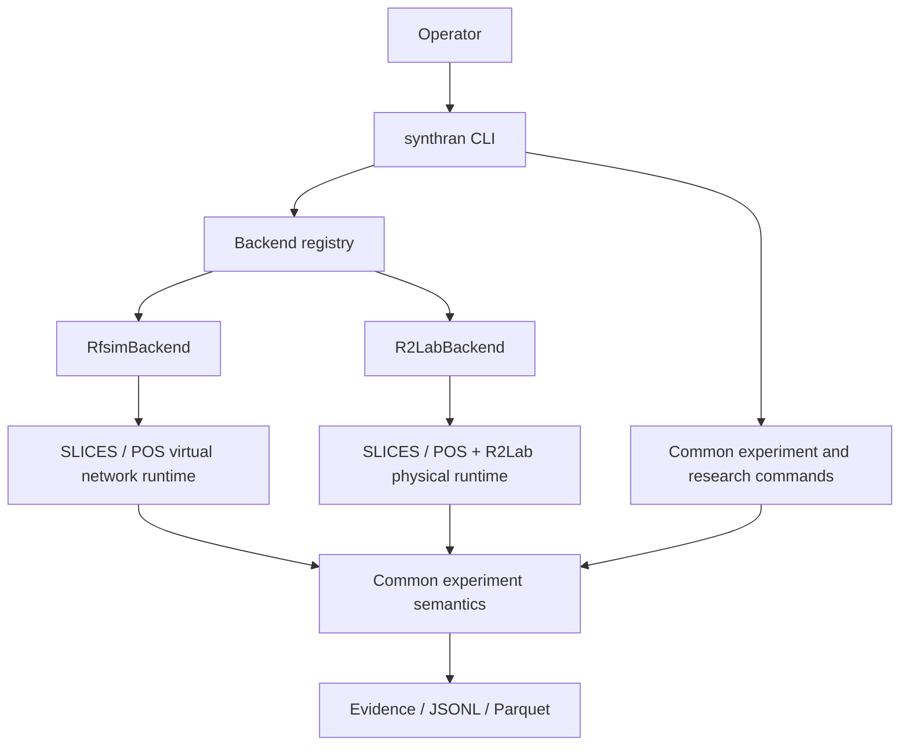

# SynthRAN architecture

SynthRAN is the experiment-control and evidence layer above existing IoT, 5G, messaging, load-generation, and testbed systems. It composes those systems; it does not fork or reimplement them.

Current live evidence is kept out of this architecture document. See [`results.md`](results.md) for accepted runs and measured results.

## System boundary



The only supported operator executable is `synthran`. There is no separate interactive frontend or external workbench protocol. `synthran.cli` is the command dispatch boundary; provider-specific execution is selected through the backend registry rather than implemented by the top-level CLI. Internal application, workspace, reconciliation, operation, and provider modules remain implementation boundaries rather than additional products.

## Backend boundary

RFSIM remains the accepted virtual reference path. R2Lab is the physical-radio implementation and must satisfy the same experiment-level semantics before a physical stage is described as accepted.

The backend contract uses one ordered lifecycle:

```text
access
-> resources
-> kubernetes
-> core
-> gNB
-> N2
-> UE management
-> cell
-> registration
-> PDU
-> user plane
-> workload
-> data
-> acceptance
-> cleanup
```

A backend may advertise only a contiguous implemented prefix of that lifecycle. Implementation capability is not live acceptance: accepted physical capability still depends on current evidence for the exact run and resources. RFSIM implements the complete reference contract; R2Lab advances through the same contract as physical stages are implemented and proven.

Backend-specific mechanisms stay below this boundary:

| Concern | RFSIM | R2Lab |
|---|---|---|
| Radio | simulated RF | selected physical radio |
| UE | srsUE | selected physical UE/modem |
| PDU interface | `tun_srsue1` | physical UE data interface such as `wwan0` |
| Cell proof | simulated cell state | current physical NR acquisition |
| Authority | SLICES/POS run authority | SLICES/POS plus current R2Lab physical authority |

Above that boundary, experiment identity, deterministic IoT inputs, telemetry semantics, research validity, evidence provenance, and cleanup rules remain common. Backend-specific interface names, resource identifiers, and provider diagnostics must not become common experiment semantics.

## Persistent state

Long-lived intent and short-lived provider truth are separated. Current workspace state may include profiles, experiment desired state, observed state, operation records, preparation authority, manifests, and immutable experiment evidence.

`ExperimentDesiredState` contains requested intent and stable constraints. Provider-assigned or runtime-discovered values belong in observed state.

Examples of observed-only facts include reservation and allocation IDs, provider-assigned nodes, pod names, live PDU addresses, lease state, registration state, and current routes.

Truth ranking is:

```text
provider
> direct observation
> persisted evidence
> manifest
> cache
```

Historical evidence proves a past event. It does not become current mutation authority after its freshness boundary expires.

## Reconciliation and operations

Reconciliation and operation policy are fail-closed. A controlled mutation must be bound to current desired state, current observations, exact targets, ownership, and relevant input digests before execution.

Representative network progression is:

```text
provider context
-> resources
-> preparation
-> core
-> gNB
-> N2
-> UE
-> registration
-> PDU
-> user plane
-> workload
-> evidence
-> cleanup
```

Risk classes remain distinct:

```text
R0  local/read-only
R1  live/read-only
R2  controlled mutation
R3  destructive mutation
```

Only one mutating operation may hold a workspace mutation claim. Failed or interrupted mutation retains the claim unless clean rollback is proven. Structured evidence and events are preferred over parsing arbitrary provider prose.

## Resource ownership

Resource selection is deterministic and capability-based. Generic rollback authority comes only from exact resource IDs proven to have been created or owned by the current operation.

Unknown, stale, foreign, or ambiguous ownership fails closed. This applies from provider resources down to run-owned processes, namespaces, temporary routes, radio state, and experiment objects. Broad cleanup is forbidden.

## Dependency composition

SynthRAN reuses complete pinned upstream checkouts and immutable runtime artifacts:

| System | Role |
|---|---|
| `sopnode/5g_ansible` | SLICES node setup and reviewed 5G deployment path |
| Open5GS | 5G core / UPF |
| srsRAN | gNB, srsUE, RFSIM and physical gNB integration |
| Contiki-NG + Cooja | deterministic constrained-IoT emulation |
| Eclipse Mosquitto | edge and central MQTT transport |
| iperf3 | external capacity calibration and controlled load |

Dependency trees live under ignored `.deps/` storage. SynthRAN-owned overlays and the IoT application remain in this repository. Runtime images and direct dependencies are pinned through repository-controlled provenance.

## Accepted virtual golden path

```text
10 deterministic Contiki-NG/Cooja sensors
-> RPL/6LoWPAN border router
-> Cooja Serial Socket
-> loopback-only reverse SSH tunnel
-> remote tunslip6/tun0
-> counted TCP ingress
-> Mosquitto bridge inside srsUE network namespace
-> tun_srsue1
-> srsRAN gNB
-> Open5GS UPF
-> run-owned central Mosquitto
-> canonical JSONL
-> deterministic Parquet
```

The Cooja Serial Socket crosses the simulator boundary, the reverse SSH tunnel exposes that loopback-only socket to the remote experiment node, `tunslip6` creates the IPv6 edge interface, counted TCP ingress records the adapter boundary, and the Mosquitto bridge runs in the srsUE network namespace where the live PDU exists.

The PDU is rediscovered after RFSIM reconciliation and is not static configuration. Acceptance includes route, interface, broker, message, cleanup, and base-network reproof evidence.

## Controlled research architecture

Controlled research wraps the deterministic workload in a fixed measurement window. Background-load service termination is outside the 5G core host so a same-host Kubernetes or hairpin path cannot masquerade as external user-plane transport.

A research run persists immutable experiment specification, exact measurement-window bounds, telemetry, RTT observations, network counters, load records when enabled, path/readiness/cleanup evidence, validity-aware summaries, and artifact hashes.

Configured cadence and achieved cadence are separate evidence. Telemetry continuity is evaluated from observed sequence gaps and duplicates rather than nominal fixed-window occupancy alone.

## Data and privacy boundary

Canonical JSONL is the append-only audit source. Deterministic Parquet is an analysis derivative, not a second source of truth. Raw immutable experiment bundles belong in durable research or object storage; small sanitized derivatives, summaries, and figures may be tracked in Git.

SynthRAN is designed to prove accepted paths without broad packet capture. Route proof, interface counters, broker receipt, run-scoped records, and UPF evidence form the default lower-risk proof surface.

Private keys, provider tokens, S3 secrets, kubeconfigs, authority files, dependency trees, generated run directories, and unsanitized secret-bearing evidence must remain outside Git.

## Current boundary of claims

The live-accepted virtual system covers Open5GS, srsRAN, one srsUE, RFSIM, deterministic ten-sensor IoT traffic, external-peer calibration, controlled UDP load, fixed-window instrumentation, randomized blocked campaigns, and offline paired analysis.

Physical RF capability is accepted only to the stage proven by current R2Lab evidence. Multi-UE or multi-slice experiments, formal RIC/A1/E2 control, generative models, and automated policy synthesis are not claimed without explicit accepted evidence.
